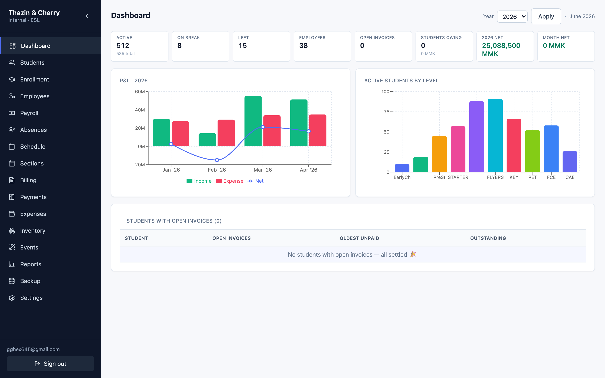

# Thazin & Cherry — School Management System

Internal admin system for an ESL school: students, enrolment, billing & payments,
scheduling, payroll, attendance, inventory, and events. Cambridge level ladder
(Early Childhood → CAE) plus Summer programs.

**Live:** https://tncengcenter.vercel.app · **Stack:** Next.js 15 (App Router) · Supabase (Postgres + Auth + RLS) · Vercel
**Supabase project ref:** `ugjujibpbasskampuums`
**Currency:** MMK — stored as `bigint`, displayed with comma separators (`100,000`).



## Features

- **Dashboard** — active students, employees, open invoices, P&L, students owing (pre-aggregated).
- **Students & Enrolment** — searchable records, enrol into sections (capacity-checked), per-student billing/payment history & outstanding balance.
- **Billing** — monthly invoice generation, on-demand itemized invoices from the fee schedule, bulk actions (mark paid / void / delete), CSV export, "undo generate".
- **Payments** — record against a specific invoice; a DB trigger auto-reconciles invoice status (`open` → `paid`) on any payment change.
- **Schedule** — weekly timetable per month, copy-from-previous, and **CSV import** of the class-schedule template grid.
- **Payroll, Absences, Inventory, Events, Reports, Backup, Settings/Users.**

## Auth & roles

Supabase Auth (email/password). Role lives in the JWT (`app_metadata.role`) and is read by `auth_role()` in RLS policies:

- `owner` — full access · `admin` — manage students/schedule/etc. · `accounts` — finance (invoices/payments) · `readonly` — limited.

## Layout

- [`app/`](app/) — Next.js 15 web app (the deployed project; Vercel **Root Directory = `app`**)
- [`supabase/`](supabase/) — migration SQL
- [`_PLAN/`](_PLAN/) — design docs (master plan, schema, ETL mapping, performance plan)
- [`etl/`](etl/) — historical Excel import scripts
- Source spreadsheets (finance / student lists) are **git-ignored** (contain PII).

## Database

**Remote-only.** All migrations and app traffic hit the hosted Supabase project. No local Postgres.
Migrations are applied via the Supabase MCP `apply_migration` tool (or `supabase db push`).
Performance baseline: foreign-key + hot-path indexes, consolidated RLS policies, and reference-data caching.

## Develop

```bash
cd app
cp .env.local.example .env.local   # fill NEXT_PUBLIC_SUPABASE_URL + ANON_KEY
npm install
npm run dev          # http://localhost:3000
npm run type-check   # tsc --noEmit
npm run build
```

## Deploy

Hosted on **Vercel** with GitHub auto-deploy: every push to `main` builds from `app/`
and deploys to https://tncengcenter.vercel.app. Preview deployments are created per branch.

Required Vercel env vars: `NEXT_PUBLIC_SUPABASE_URL`, `NEXT_PUBLIC_SUPABASE_ANON_KEY`.

